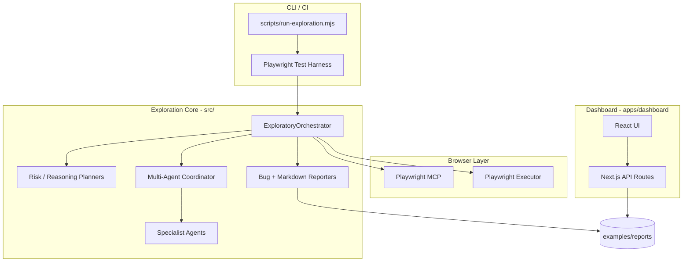

# Playwright MCP Exploratory Agent

[](https://playwright-mcp-exploratory-agent.vercel.app)

AI-assisted exploratory testing platform built on [Playwright](https://playwright.dev) and the [Playwright MCP](https://github.com/microsoft/playwright-mcp) server. It autonomously explores web applications, coordinates specialist agents (accessibility, network, visual, security smoke), produces structured findings, generates Playwright tests from verified flows, and surfaces results in a Next.js dashboard.

**Live dashboard:** https://playwright-mcp-exploratory-agent.vercel.app

## What problem this solves

Manual exploratory testing is slow, inconsistent, and hard to document. This project automates structured exploration while keeping humans in control through safety rules, personas, and non-destructive action policies. It helps teams:

- Discover functional, accessibility, network, and visual issues early
- Capture reproducible bug reports and session memory
- Convert verified interactions into Playwright tests
- Review exploration health in a single dashboard

## Architecture overview



## Tech stack

| Layer | Technology |
| --- | --- |
| Browser automation | Playwright, `@playwright/mcp` |
| Agent runtime | TypeScript (Node.js 20+) |
| Accessibility | axe-core |
| Visual diff | pixelmatch, pngjs |
| LLM reasoning (optional) | Google Gemini, OpenAI, Anthropic providers |
| Dashboard | Next.js 15, React 19, Tailwind CSS, Recharts |
| Tests | Playwright Test, Vitest (dashboard unit tests) |

## Folder structure

```
├── apps/dashboard/     # Next.js exploration dashboard
├── config/             # Playwright, TypeScript, MCP, exploration config
├── docs/               # Architecture, deployment, troubleshooting
├── examples/           # Sample reports and reference inputs
├── scripts/            # CLI entrypoints for exploration runs
├── src/                # Exploration agent core (orchestrator, agents, reporting)
├── tests/              # Playwright unit and integration tests
├── .env.example        # Environment variable template
├── CONTRIBUTING.md
├── LICENSE
└── README.md
```

## Prerequisites

- **Node.js** 20 or newer
- **npm** 10+
- Optional: **Google AI Studio API key** for live LLM reasoning (`GEMINI_API_KEY`)
- Optional: **Playwright MCP** in any MCP-compatible agent (Cursor, VS Code, Claude Desktop, Windsurf, and others) — see [MCP integration](#mcp-integration-any-mcp-compatible-agent)

## Installation

```bash
git clone https://github.com/guimmamanna/playwright-mcp-exploratory-agent.git
cd playwright-mcp-exploratory-agent
npm install
cp .env.example .env
```

Playwright browsers are installed automatically via `postinstall` (Chromium). To install all browsers:

```bash
npx playwright install
```

## Environment variables

Copy `.env.example` to `.env`:

| Variable | Required | Description |
| --- | --- | --- |
| `EXPLORATORY_BASE_URL` | No | Target app URL (default: Playwright TodoMVC demo) |
| `GEMINI_API_KEY` | No | Enables live AI reasoning; mock provider used otherwise |
| `GEMINI_MODEL` | No | Gemini model id (default: `gemini-2.0-flash`) |
| `HEADLESS` | No | `true` / `false` for browser visibility |
| `EXPLORATORY_REPORTS_DIR` | No | Report output directory for local runs |

## Run locally

### Dashboard (recommended first step)

```bash
npm run dashboard:dev
```

Open http://localhost:3100 — the UI loads sample data from `examples/reports/`.

### Unit / integration tests (no live browser target)

```bash
npm run test:unit
```

### Full Playwright suite

```bash
npm test
```

### Live exploration (requires network; uses real browser)

```bash
npm run explore
# or with visible browser:
npm run explore:headed
```

Reports are written under `reports/exploratory/runs/`.

### Distributed exploration harness

```bash
npm run explore:distributed:ci
```

## Reproduce the POC

1. Clone, install, and copy `.env.example` → `.env`.
2. Start the dashboard: `npm run dashboard:dev`.
3. Confirm the **Overview** page shows the demo session (`demo-session-001`).
4. Run fast tests: `npm run test:unit` (should pass without API keys).
5. Optional — live exploration against the default demo app:
   ```bash
   npm run explore:headed
   ```
6. Open new findings under `reports/exploratory/runs/` and refresh the dashboard.

See [docs/troubleshooting.md](docs/troubleshooting.md) for common issues.

## Example commands

```bash
# Dashboard production build
npm run dashboard:build && npm run dashboard:start

# Dashboard unit tests
npm run dashboard:test

# Exploration against a custom URL
EXPLORATORY_BASE_URL=https://example.com npm run explore

# Playwright HTML report
npm run report
```

## Deployment

The dashboard deploys to **Vercel** (free tier).

### Redeploy on Vercel

1. Import the GitHub repository in [Vercel](https://vercel.com/new).
2. Set **Root Directory** to `apps/dashboard`.
3. Use default install/build commands from `apps/dashboard/vercel.json`.
4. Optional env: `EXPLORATORY_REPORTS_DIRS=../../examples/reports`
5. Deploy.

CLI alternative (requires [Vercel CLI](https://vercel.com/docs/cli)):

```bash
cd apps/dashboard
npx vercel --prod
```

Details: [docs/deployment.md](docs/deployment.md)

## MCP integration (any MCP-compatible agent)

This project uses the [Model Context Protocol (MCP)](https://modelcontextprotocol.io). You are **not** limited to Cursor — any client that supports MCP can connect to the Playwright MCP server and work with this codebase.

Copy `config/mcp.json.example` into your agent’s MCP configuration file:

| Agent / client | Typical config location |
| --- | --- |
| Cursor | `.cursor/mcp.json` (project) or Cursor Settings → MCP |
| VS Code | `.vscode/mcp.json` or MCP extension settings |
| Claude Desktop | `claude_desktop_config.json` (see Claude docs for OS path) |
| Windsurf | `.windsurf/mcp.json` or Windsurf MCP settings |
| Other MCP clients | Use the config path documented by your tool |

Example server entry (same for all clients):

```json
{
  "mcpServers": {
    "playwright": {
      "command": "npx",
      "args": ["@playwright/mcp@latest"]
    }
  }
}
```

After adding the config, restart your agent or reload MCP servers. Exploration can also run without MCP via the CLI (`npm run explore`) and Playwright tests.

## Known limitations

- Live exploration depends on target site stability and rate limits.
- LLM reasoning requires an API key; without it, mock/heuristic reasoning is used.
- Vision analysis defaults to a mock provider unless OpenAI vision keys are set.
- Distributed workers are harness-based; production worker pools need external orchestration.
- The dashboard reads filesystem reports — serverless deploys show bundled sample data unless you attach external storage.

## Future improvements

- Persistent report storage (S3 / database) for production dashboard hosting
- Pluggable worker queue (Redis, BullMQ) for distributed runs
- CI GitHub Action template for scheduled explorations
- Stronger vision provider abstraction and cost controls
- Interactive replay of exploration steps in the dashboard

## Documentation

- [Architecture](docs/architecture.md)
- [Deployment](docs/deployment.md)
- [Troubleshooting](docs/troubleshooting.md)
- [Security](docs/security.md)

## License

MIT — see [LICENSE](LICENSE).
